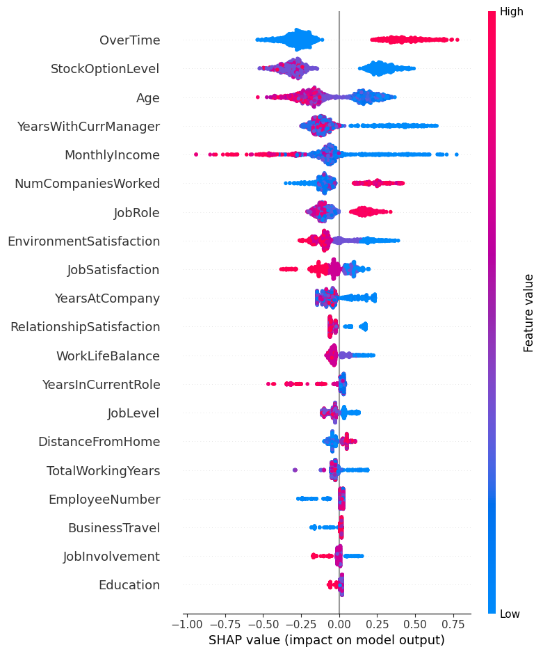

# Employee Attrition Prediction using XGBoost and SHAP

This project builds a machine learning model to predict **employee attrition** using the **IBM HR Analytics Attrition Dataset**. The goal is to identify employees who are at risk of leaving the organization so that companies can take proactive retention measures.

The project uses **XGBoost**, a powerful gradient boosting algorithm, and **SHAP (SHapley Additive exPlanations)** to interpret the model and understand the key factors driving employee attrition.

---

# Dataset

**Dataset Used:** IBM HR Analytics Attrition Dataset  

**Source:**  
https://www.kaggle.com/datasets/pavansubhasht/ibm-hr-analytics-attrition-dataset

The dataset contains approximately **1500 employee records** and multiple attributes describing employee demographics, job roles, satisfaction levels, and work environment.

### Target Variable

Attrition  
- **Yes** → Employee left the company  
- **No** → Employee stayed

### Important Features

- Age
- JobRole
- MonthlyIncome
- OverTime
- YearsAtCompany
- YearsWithCurrManager
- JobSatisfaction
- WorkLifeBalance
- StockOptionLevel

---

# Project Objective

The objectives of this project are:

- Predict whether an employee will leave the company
- Handle **class imbalance** in the dataset
- Evaluate model performance using multiple metrics
- Identify the most important factors influencing attrition
- Use **SHAP explainability** to interpret the model

---

# Methodology

## 1. Data Preprocessing

- Converted categorical variables using **Label Encoding**
- Split dataset into **training (80%) and testing (20%)**
- Addressed **class imbalance** using XGBoost's `scale_pos_weight`

## 2. Model Training

The model used in this project:

**XGBoost Classifier**

Advantages:

- Handles nonlinear relationships
- Strong predictive performance
- Built-in feature importance
- Robust to overfitting

---

# Model Performance

## Training Performance

**Accuracy:** 87.76%

### Confusion Matrix

| | Predicted No | Predicted Yes |
|---|---|---|
| Actual No | 768 | 95 |
| Actual Yes | 31 | 135 |

| Class | Precision | Recall | F1 Score |
|------|------|------|------|
| No Attrition | 0.96 | 0.89 | 0.92 |
| Attrition | 0.59 | 0.81 | 0.68 |

---

## Test Performance

**Accuracy:** 77.78%

### Confusion Matrix

| | Predicted No | Predicted Yes |
|---|---|---|
| Actual No | 308 | 62 |
| Actual Yes | 36 | 35 |

| Class | Precision | Recall | F1 Score |
|------|------|------|------|
| No Attrition | 0.90 | 0.83 | 0.86 |
| Attrition | 0.36 | 0.49 | 0.42 |

Predicting attrition is difficult because the dataset is **imbalanced**, but the model still captures meaningful patterns.

---

# Feature Importance

Top features influencing employee attrition:

1. YearsAtCompany
2. YearsWithCurrManager
3. StockOptionLevel
4. OverTime
5. JobLevel
6. Age
7. MonthlyIncome
8. JobRole
9. JobSatisfaction

These variables suggest that **career progression, workload, compensation, and managerial relationships** strongly influence employee turnover.

---

# SHAP Explainability

To interpret model predictions, **SHAP (SHapley Additive exPlanations)** was used.

SHAP helps explain:

- Which features influence predictions
- Whether a feature increases or decreases attrition risk

## SHAP Summary Plot

### Key Insights

- Employees working **overtime frequently are more likely to leave**
- **Lower stock option levels** increase attrition risk
- **Younger employees** tend to leave more often
- **Lower income** increases attrition probability
- Longer tenure with a **current manager reduces attrition**

These insights can help HR teams develop targeted retention strategies.

---

# Business Insights

The analysis suggests several actionable insights for HR management:

- Reduce excessive overtime to improve work-life balance
- Provide better stock options and compensation incentives
- Improve employee-manager relationships
- Focus retention efforts on early-career employees
- Provide career growth opportunities to long-tenure employees

Using predictive analytics can help organizations **identify high-risk employees early and intervene proactively**.

---

# Technologies Used

- Python
- XGBoost
- Scikit-learn
- SHAP
- Pandas
- Matplotlib

---

# Future Improvements

Possible improvements include:

- Using **SMOTE or ADASYN** for better imbalance handling
- Hyperparameter tuning with **GridSearch or Optuna**
- Comparing with **Random Forest and LightGBM**
- Deploying the model as an **HR analytics dashboard**
- Building a **real-time attrition prediction system**

---

# Conclusion

This project demonstrates how machine learning can be used to predict employee attrition and identify the factors influencing employee turnover.

The XGBoost model achieved reasonable predictive performance and provided valuable insights into employee retention. Combining machine learning with explainability techniques such as SHAP enables organizations to make **data-driven HR decisions** and improve employee satisfaction and retention.
